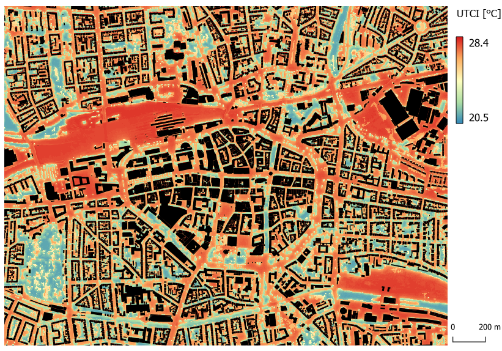

.. _overview:

Overview
=========

.. _introduction:

Introduction
------------

The data-driven urban climate adaptation project Data2Resilience (D2R) implements data-driven actions and services to enhance Dortmund's resilience to extreme heat.
It deploys a state-of-the-art biometeorological sensor network and develops a nowcasting service for monitoring thermal comfort throughout the city.
This real-time information aims to guide on-ground actions and services for smarter urban climate comfort planning,
pioneering the integration of thermal comfort data within Dortmund's smart city ecosystem.

The nowcasting service provides real-time information about the weather and thermal comfort conditions in the city of Dortmund.
This information is retrieved from the biometeorological weather stations and from Numerical Weather Predictions (NWP)
from the ICON-D2 model, which is DWD’s regional numerical weather prediction model. The processing of the data is done in the backend
of the service and includes the following processes: simulation of the radiation fluxes and the mean radiant temperature (MRT);
geostatistical interpolation of the network data; and calculation of a thermal comfort index,
namely the UTCI, at street level resolution.
The service’s frontend provides an interactive webmap and relevant plots that present the thermal comfort in the city.
An example of the UTCI data provided by D2R’s nowcasting service over Dortmund’s city center is given in :numref:`utci_sample`.

The D2R nowcasting service is open source.
At its core it uses the Urban Multi-scale Environmental Predictor (`UMEP <https://umep-docs.readthedocs.io/en/latest/>`__)
climate service tool, which is designed for researchers and service providers (e.g. architects, climatologists, energy, health and urban planners),
and in-house software developed by the `Bochum Urban Climate Lab <https://www.geographie.ruhr-uni-bochum.de/klima/index.html.en>`__.

	An example of the UTCI data provided by D2R’s nowcasting service over Dortmund’s city center for 2024-06-24 12:00 UTC.

.. _problem_d2r_solves:

What is the problem D2R solves?
-------------------------------

Extreme heat endangers human health and well-being and impairs the use of public spaces.
Dortmund’s Integrated Climate Adaptation Master Plan (`MiKaDo <https://www.dortmund.de/themen/umwelt-nachhaltigkeit-und-klimaschutz/klimaschutz-und-klimafolgenanpassung/klimafolgeanpassung/masterplan-integrierte-klimafolgenanpassung/>`__)
puts a priority on actions and measures that improve heat resilience.
D2R implemented data-driven actions and services to support officials
from the City of Dortmund in improving the city’s resilience to extreme heat.
We view D2R as a key step towards achieving the goal of climate-resilient and sustainable urban development that is set in MiKaDo.
MiKaDo forms the basis for the implementation of local climate adaptation measures and recognizes extreme heat and thermal
discomfort as major risks for the health and well-being of its citizens. It promotes the adoption of measures that protect
climate-sensitive facilities (hospitals, nursing homes, etc.) from extreme temperatures and reduce the exposure of vulnerable groups.
To achieve these objectives, spatially detailed data about the excess heat and thermal comfort—defined as the state-of-mind in which
a person feels satisfied with the surrounding thermal environment (i.e., not too hot or too cold)—, across Dortmund are required,
which are currently missing. The D2R project addresses this gap and provides the necessary spatial and meteorological data by
co-deploying a state-of-the-art network of biometeorological weather stations designed to measure thermal comfort and a service that
provides fine resolution nowcasts of thermal discomfort.
More details can be found on the `project website <https://data2resilience.de/>`__.
