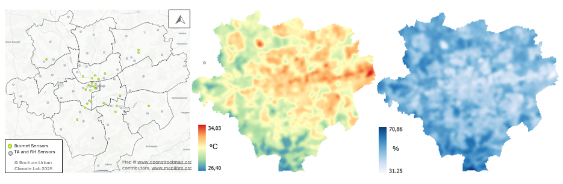

.. _input_data:

Input Data
==========

To model thermal discomfort, the nowcasting service utilizes raster data describing the urban form and meteorological conditions.
The urban form data include various Digital Surface Models that represent the ground, building, and tree canopy heights,
as well as the land cover and the Sky View Factor (SVF). The weather data should provide the meteorological conditions at a height
of 2 meters above ground, including the near-surface air temperature, the relative humidity, and the wind speed.
All input raster data have to be formatted according to the specifications used by `UMEP’s SOLWEIG model <https://umep-docs.readthedocs.io/en/latest/OtherManuals/SOLWEIG.html>`__,
a core component of the nowcasting service.

.. note::

	Details of SOLWEIG’s model inputs and outputs can be found `here <https://umep-docs.readthedocs.io/en/latest/OtherManuals/SOLWEIG.html>`__.

.. warning::

	All the input variables should have the same extent and pixel resolution and be provided in a projected Coordinate Reference System (CRS).

The sections below provide a detailed list of the input data, as well as how they are organized into folders and subfolders.

.. _urban_form_data:

Data Describing the Urban Form 
------------------------------

The urban form refers to the physical layout of the city, including its three-dimensional structure and land cover. The urban form data used by D2R’s nowcasting service as provided in :numref:`urban_data_table`:

.. list-table:: The urban form data used by D2R’s nowcasting service
	:widths: 5 15 45 20 10
	:align: left
	:header-rows: 1
	:name: urban_data_table

	* - 
	  - Name
	  - Description
	  - Units
	  - File type
	* - 1
	  - DEM
	  - Digital Elevation Model
	  - meters a.s.l.
	  - GeoTIFF
	* - 2
	  - Building DSM
	  - A DSM consisting of ground and building heights
	  - meters a.s.l.
	  - GeoTIFF
	* - 3
	  - Canopy DSM
	  - A DSM consisting of pixels with vegetation heights
	  - meters a.g.l.
	  - GeoTIFF
	* - 4
	  - Land Cover
	  - Categorizes the urban surface in the seven classes expected by UMEP (see `here <https://umep-docs.readthedocs.io/en/latest/pre-processor/Urban%20Land%20Cover%20Land%20Cover%20Reclassifier.html>`__)
	  - 
	  - GeoTIFF
	* - 5
	  - SVF*
	  - The sky view factor (SVF) is the ratio of the visible sky area of a point in space to the total sky area. A dimensionless measure between zero and one, representing totally obstructed and free spaces, respectively
	  - 
	  - GeoTIFF
	* - 6
	  - Wall Height*
	  - The height of the wall pixels
	  - meters a.g.l.
	  - GeoTIFF
	* - 7
	  - Wall Aspect*
	  - The aspect of the wall pixels relative to the ground level. Wall aspect is given in degrees where a north facing wall pixel has a value of zero
	  - degrees where a north facing wall pixel has a value of zero
	  - GeoTIFF

.. note::

	\* The SVF, the Wall Height, and the Wall Aspect datasets should be created using the corresponding pre-processors from UMEP that require as input the using the ground and building, and canopy DSM (see `here <https://umep-docs.readthedocs.io/en/latest/pre-processor/Urban%20Geometry%20Sky%20View%20Factor%20Calculator.html>`__ for the SVF and `here <https://umep-docs.readthedocs.io/en/latest/pre-processor/Urban%20Geometry%20Wall%20Height%20and%20Aspect.html>`__ for the Wall Height & Aspect).

The DEM, DSM, and land cover data used in Data2Resilience were sourced from GEOportal NRW (see DSM `here <https://www.bezreg-koeln.nrw.de/geobasis-nrw/produkte-und-dienste/hoehenmodelle/digitale-gelaendemodelle/digitales-gelaendemodell>`__ and land cover `here <https://www.bezreg-koeln.nrw.de/geobasis-nrw/produkte-und-dienste/luftbild-und-satellitenbildinformationen/aktuelle-luftbild-und-3>`__).
For the building DSM, the heights were extracted from the availabe DSM at building sites according to the land survey register (`ALKIS <https://open-data.dortmund.de/explore/dataset/liegenschaftskataster-gebaude-bauwerke/information>`__) and given in meter above sea level (a.s.l.).
For canopy DSM, we extracted tree heights from the DSM with a mask generated from the tree map of `Google's Environmental Insights Explorer <https://insights.sustainability.google/places/ChIJEXrwv2AXuUcRUIdUMYHyJwQ/trees?hl=en-US>`__ and transformed the heights to be above ground level (a.g.l.), as SOLWEIG expects this.
For land cover we manually reduced the 15 land cover classes for the dataset into those expected by SOLWEIG.
These datasets have been resampled to a 3-meter regular grid, clipped to the same boundaries, and saved as GeoTIFFs.
The Coordinate Reference System (CRS) is ETRS89 / UTM zone 32N (EPSG: 25832). The SVF, wall height, wall aspect,
and daily shadow maps were derived using the appropriate UMEP methods, with the building and canopy DSM as inputs.
To facilitate data processing and speed up calculations, the resulting files have been tiled using GDAL into 120 tiles,
each with a size of 1000 x 1000 pixels and a 20% overlap. The tiling scheme used is shown in :numref:`tiling_map`.

.. figure:: data/02_overlap_map_dortmund.png
	:align: center
	:scale: 80
	:alt: The employed tiling scheme.
	:name: tiling_map

	The employed tiling scheme.

.. _weather_data:

Data Describing the Weather Conditions
--------------------------------------

Assessing the outdoor human thermal comfort requires detailed information on radiation, wind, temperature, and humidity in the exposure environment.
Acquiring this information with high spatial resolution is extremely difficult since the ambient environment is dynamic and highly variable over very short distances.

D2R has been collecting weather data from two different data sources.

Numerical Weather Predictions
^^^^^^^^^^^^^^^^^^^^^^^^^^^^^

It uses Numerical Weather Predictions (NWP) from DWD’s ICOsahedral Nonhydrostatic model (ICON).

ICON is the global and regional numerical weather prediction model at DWD. D2R uses the ICON-D2 convection-permitting model setup,
which is DWD’s finest resolution weather model (`see here <https://dwd-geoportal.de/products/G_E6D/>`__). It covers Germany, Switzerland, Austria, and other neighboring countries with a grid cell
resolution of approximately 2 km. Forecasts of ICON-D2 are performed 8 times a day (namely at 00, 03, 06, 09, 12, 15, 18, 21 UTC),
with a forecast range of 48 h. The ICON-D2 forecast data for each weather element are made available via opendata.dwd.de,
both on a rotated grid and on a regular grid. D2R uses the following eight elements:

.. list-table:: Used variables of ICON-D2 model
   :header-rows: 1
   :name: nwp_table

   * - Variable
     - Description
   * - ``t_2m``
     - The air temperature at a height of 2 m above ground (see :numref:`icon_data_sample`).
   * - ``relhum_2m``
     - The relative humidity at a height of 2 m above ground (see :numref:`icon_data_sample`).
   * - ``u_10m``
     - The East-West wind components
   * - ``v_10m``
     - The North-South wind components
   * - ``tot_prec``
     - The total precipitation
   * - ``asob_s``
     - The shortwave net radiation flux
   * - ``ASWDIR_S``
     - The downward solar direct radiation flux
   * - ``ASWDIFD_S``
     - The downward solar diffuse radiation flux

The ``u_10m`` and ``v_10m`` variables (both in m/s) in the ICON model represent the zonal (east-west) and meridional (north-south)
wind speeds at 10 meters above the ground, respectively. A positive value for ``u_10m`` indicates that the wind is blowing from
west to east (in the direction of increasing longitude), while a negative value for ``u_10m`` indicates that the wind is blowing
from east to west (in the direction of decreasing longitude). Similarly, a positive value for ``v_10m`` indicates that the wind
is blowing from south to north (in the direction of increasing latitude), while a negative value for ``v_10m`` indicates that
the wind is blowing from north to south (in the direction of decreasing latitude). The wind speed is calculated from the
``u_10m`` and ``v_10m`` using the Pythagorean theorem.

.. figure:: data/02_icon2d_data_dortmund.png
   :align: center
   :alt: An example of the ``t_2m``, ``relhum_2m``, and ``asob_s`` ICON-D2 data for a random day in Dortmund.
   :name: icon_data_sample

   An example of the ``t_2m``, ``relhum_2m``, and ``asob_s`` ICON-D2 data for a random day in Dortmund.

To download the ICON-D2 data, a software tool has been developed using Python-3 that automatically downloads and pre-processes the
ICON-D2 forecasts for Dortmund. In particular, the tool starts by downloading all the GRIB2 files for the selected fields
(e.g., the 2 m air temperature, the relative humidity, etc.). It then clips the raster data to the city bounds, and stacks the
corresponding forecasts into datacubes (one per field), which then saves as netCDF files in D2R’s dedicated data repository.

In-Situ Measurements
^^^^^^^^^^^^^^^^^^^^

The second source of meteorological data is the weather station network in the city of Dortmund, also developed during the Data2Resilience project.
This is a state-of-the-art meteorological weather station network with 80 stations at 76 locations installed throughout the city and at a height of around 3.30 meters.
55 stations measure air temperature and relative humidity while 25 measure a comprehensive set of biometeorological parameters including also radiation, wind and precipitation etc.
Four locations are equipped with both sensor types to assess the accuracy of the different devices over time.
See more details on the stations at the `D2R Dashboard <https://dashboard.data2resilience.de/de>`__.
With a measurement frequency of five minutes, the network allows to assess current weather situations in Dortmund with a high
spatial and temporal resolution and therefore is the preferred source for this service.

From the `network's api <https://api.data2resilience.de/docs>`__ air temperature (°C) and relative humidity (%) information is
retrieved at the beginning of each pipeline run (every hour).

The stations send their measurements via the LoRaWAN technology which is by design affected by packet loss.
In case not enough data is available for forcing the SOLWEIG model, the NWP data is the back-up source.

Furthermore, the stations are not in sync regarding their measurement and sending time.
To ensure that the data is up-to-date, latest data not older than 15 minutes is requested from all stations, which results in a
list of a single measurement per station which has data available.
To consider shadow movements (i.e. some passing of time) in the SOLWEIG radiation modeling later, the concept *latest data* is used but for the *previous hour*.
For this, again data for a time window of 15 minutes is requested, but from the previous hour (for hourly model runs) and in case
of multiple measurements available, only the latest of these is kept per station.

A short example:

- Current hour to model is 12:00, the latest data is requested via the ``latest_data`` endpoint of the network's API, which is not older than 11:45
- Previous hour is 11:00 and the data for this time is requested from the window 10:45 - 11:00 per station via the ``data`` endpoint.
- Note, that all times are given in UTC.

The measurement data is interpolated to generate rasters that reflect the distribution of the two parameters across the city (see :numref:`station_network_interpolation`).
More information on the use of meteorologial data, the interpolation process and further processing is given in :numref:`methods_and_processes`.

   A map of the station distribution across dortmund and the derived ``air temperature`` and ``relative humidity`` rasters for a random day in Dortmund.

.. _file_organization:

File organization
-----------------

The input files are organized into subfolders as shown in the directory tree below. The root directory includes two folders:
the folder "dynamic" contains the variables that are continuously gathered or generated by the project, like the ICON-D2 NWP,
while the folder "static" contains the variables that remain constant over time, such as the DSM.
For some folders exemplary names of subdirectories or files are added.

.. code-block:: text

	Common Parent Folder
	├── dynamic data
	│	├── icon-d2-data
	│	│	└── YYYYMMDDHH
	│	├── metadata
	│	├── metfiles
	│	├── MRT
	│	├── RH
	│	├── SOLWEIG_3m_1000+200
	│	├── station_data
	│	├── TA
	│	├── UTCI
	│	│	└── DO_UTCI_YYYY_DOY_HH_vX.Y.Z_cog.tif
	│	└── UTCI_CLASS
	└── static data
		├── Building DSM
		├── Canopy DSM
		├── DTM
		├── Land Cover
		└── SOLWEIG preprocess (SVF, Wall Height, Wall Aspect per tile)

