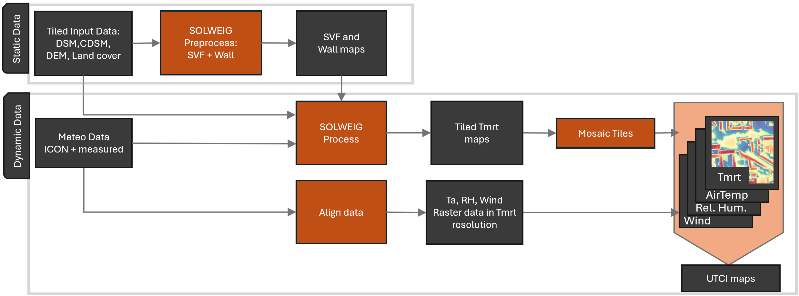
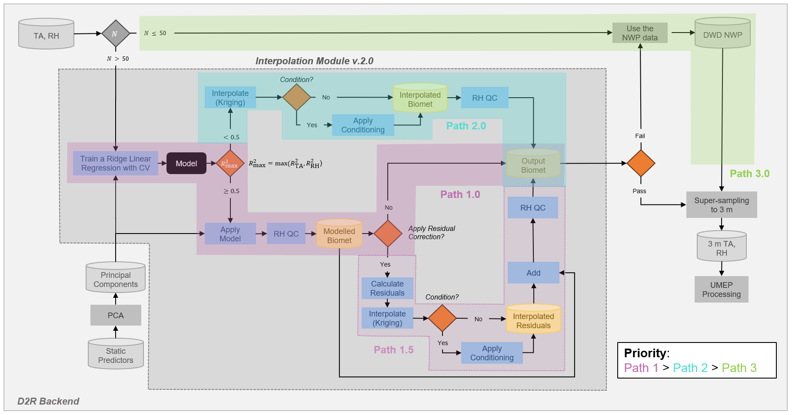
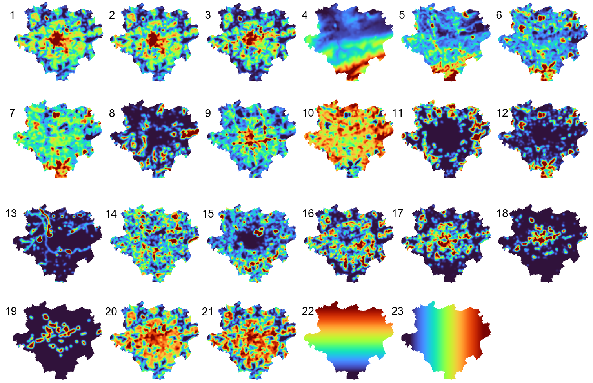
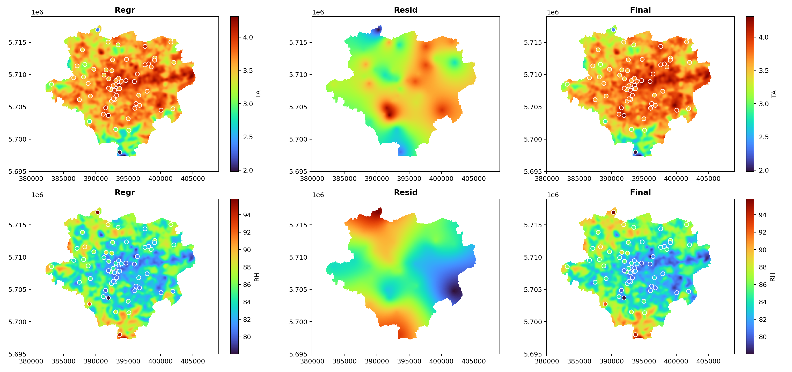

.. _methods_and_processes:

Methods and Processes
=====================

The approach to model thermal comfort is based on the `UMEP-Toolbox <https://umep-docs.readthedocs.io/en/latest/>`__ developed by Lindberg et al. [1]_.
For thermal comfort assessment we selected the well-known and well-researched UTCI (Universal Thermal Climate Index, see :numref:`utci`), which is driven by the following four meteorological parameters:

* Near Surface Air Temperature (°C)
* Relative Humidity (%)
* Mean Radiant Temperature (°C)
* Wind (10m above ground) (m/s)

From NWPs and weather observations we can derive three of these parameters; Mean Radiant Temperature is driven by radiative forcing and calculated in our case via the SOLWEIG model [2]_ from the UMEP-Toolbox.
SOLWEIG is applied in a tile-wise manner due to the large data volume, following the UMEP’s recommendation of tiling the input data before running the SOLWEIG  model:

	*This plugin is computationally intensive i.e. large grids will take a lot of time and very large 
	grids will not be possible to use. Large grids e.g. larger than 4000000 pixels should 
	preferably be tiled before.* [3]_ 

For running the tool in our targeted resolution we tile the city using a regular overlapping grid (see :numref:`tiling_map`). The overlap is needed because
neighboring buildings create shadows which are necessary to consider during the radiation modeling and might be split in two or more tiles.
The workflow of the service’s backend is shown in :numref:`backend_workflow_image`. In the following subsections, the various processes
(orange boxes in :numref:`backend_workflow_image`) are described in the order of application.

	The backend workflow. The grey color is used to represent data and the orange is used for processes.

.. _processing_steps:

Processes
---------

Preprocessing
~~~~~~~~~~~~~

For running SOLWEIG two steps of preprocessing are required, namely the creation of the SVF and wall height and aspect maps, which are later
used to calculate the 3D radiation fluxes. Both processes can be run via the UMEP-Toolbox as well. Both need the combined Building and Ground
DSM to derive the respective information.

See their respective manuals from UMEP for details:
	* `SkyViewFactor Manual <https://umep-docs.readthedocs.io/en/latest/pre-processor/Urban%20Geometry%20Sky%20View%20Factor%20Calculator.html>`__
	* `Wall Height and Aspect <https://umep-docs.readthedocs.io/en/latest/pre-processor/Urban%20Geometry%20Wall%20Height%20and%20Aspect.html>`__

Alignment of Weather Data
~~~~~~~~~~~~~~~~~~~~~~~~~

As described in the previous chapter (see :numref:`weather_data`) and also in :numref:`backend_workflow_image` two sources of weather information
namely NWP and in-situ measurements are used.

For Numerical Weather Predictions (NWP) we use the data by the `ICON-D2 model <https://dwd-geoportal.de/products/G_E6D/>`__ of the DWD
ICON-D2 creates a horizontal resolution of ~2 km for Germany and to some extent covers regions across the German borders.
Since February 5 2025 the ICON-D2 NWP product is running with the TERRA_URB module and therefore incorporates effects of the urban canopy layer (see `Change log, section 2 <https://www.dwd.de/DE/fachnutzer/forschung_lehre/numerische_wettervorhersage/nwv_aenderungen/_functions/DownloadBox_modellaenderungen/icon_d2/pdf_2025/pdf_icon_d2_05_02_2025_terra_urb.pdf?__blob=publicationFile&v=3>`__).
The NWP data of the listed parameters in :numref:`nwp_table` (see :numref:`weather_data`) is therefore cropped to the city boundaries and
supersampled to match the resolution of the surface models.
Since the 2 km resolution only gives average values for the area, local in-situ measurements are additionally considered to get a more precise view.

The meteorological measurement network is installed in the city area and measures weather parameters at 76 locations.
To generate a sensible rasters that considers measurements in context of the urban form we developed a interpolation module which is explained in detail in the next section.
In short, this module checks the availability of enough recent measurements from the network and if so follows a method to generate these
meaningful rasters of **Air Temperature and Relative Humidity** (see :numref:`station_network_interpolation`).
If not, the ICON-D2 data for these two parameters is used as a back-up option, for which the parameter values at the different station locations are extracted from the supersampled ICON-D2 rasters.

The other relevant meteorological parameters for forcing SOLWEIG are taken from the ICON-D2 data.

.. _methods_interpolation:

Geostatistical Interpolation Module
~~~~~~~~~~~~~~~~~~~~~~~~~~~~~~~~~~~

D2R’s nowcasting service relies on air temperature (Tair) and relative humidity (RH) measurements from the biometeorological weather station network to calculate the UTCI rasters.
To accomplish this, the station data are converted into a continuous raster surface covering the entire city, following the workflow outlined in :numref:`interpolation_workflow_image`.
The primary method used is Regression Kriging, which is a geostatistical method that combines two steps:
a regression model that relates the target variable (e.g., Tair) to auxiliary variables (predictors), and kriging to interpolate the residuals of that regression, enhancing the spatial accuracy of the final surface.

   The workflow of D2R’s geostatistical interpolation module.

Design of the Interpolation Module
^^^^^^^^^^^^^^^^^^^^^^^^^^^^^^^^^^

To ensure robust, uninterrupted operation, even in cases of data failure or degraded conditions, the interpolation module incorporates 3.5 distinct processing paths. These paths act as fallback options, guaranteeing that a UTCI raster can always be generated. The primary methods are Path 1.0 and Path 1.5 (both shown in pink in :numref:`interpolation_workflow_image`). Path 1.0 performs a direct regression from station data to a continuous surface, while Path 1.5 extends this approach by kriging the residuals of the regression. Path 2.0 (blue path) skips the regression step if its performance is subpar and applies kriging directly to the station data. As a last resort, Path 3.0 (green path) bypasses station data entirely and instead supersamples the Tair and RH fields from the ICON-D2 numerical weather prediction model provided by the German Weather Service (DWD).

The selection of the most appropriate path is determined by a series of internal checks placed at different workflow steps, illustrated as orange diamonds in :numref:`interpolation_workflow_image`. These checks primarily rely on accuracy statistics, specifically the R2 value, calculated using a 4-fold cross-validation scheme. Cross-validation is a statistical technique used to evaluate a model’s reliability by repeatedly splitting the dataset into training and validation subsets. Given the limited number of stations (N = 80), a separate verification subset is not created. The workflow follows a predefined priority order: Paths 1.0 and 1.5 are the preferred methods, followed by Path 2.0, with Path 3.0 serving as the final fallback. The decision between Paths 1.0 and 1.5 is controlled by the `RESCORR` flag—if set to true, the workflow adopts Path 1.5, utilizing regression kriging instead of simple regression. This flexible, multi-path approach ensures high reliability and adaptability of the UTCI production process, even under varying data conditions.

.. figure:: data/03_geostat_2_tair_product.png
   :align: center
   :width: 80%
   :alt: Example of the Tair predictions from Paths 1.5, 1.0, and 2.0 of D2R’s interpolation module.
   :name: interpolation_tair_example

   Example of the Tair predictions from Paths 1.5 (left), 1.0 (middle), and 2.0 (right) of D2R’s interpolation module. The point markers indicate the corresponding weather station measurements that have been used as input (observation date: February 6, 2025, at 06:30 UTC).

An example of the output generated by Paths 1.5, 1.0, and 2.0 is presented in :numref:`interpolation_tair_example`. It is evident that Paths 1.0 and 1.5, which incorporate auxiliary surface information, such as building heights, produce spatial fields that are more physically realistic and better aligned with expected urban microclimate patterns. In contrast, the output from Path 2.0 appears noticeably smoother, lacking the finer spatial variability introduced by the auxiliary predictors. Despite these differences in spatial detail, all three methods show strong agreement with the input station data, as indicated by the point markers in :numref:`interpolation_tair_example`.

The auxiliary information used in the interpolation process, shown in :numref:`interpolation_auxiliary_predictors`, consists of 23 predictors that capture key characteristics of the urban environment. These include variables describing the built-up and vegetation fractions, the building heights, the topography, the sky-view factor (SVF), the climatopes (i.e., areas with similar microclimatic conditions), the cold-airflow patterns, and the geographic coordinates (longitude and latitude) of each grid cell. All predictors have been precomputed at a spatial resolution of 100 meters using high-resolution geospatial data from NRW or generated by the D2R consortium.

   The 23 predictors used by D2R’s interpolation module, namely: (1) mean building height; (2) SD of building heights; (3) build-up fraction; (4) mean elevation; (5) SD of elevation; (6) vegetation fraction; (7) mean vegetation height; (8) cold airflow pool fraction; (9) road fraction; (10) mean SVF of urban canyons; (11-18) climatopes; (19) industrial areas fraction; (20) mean building area; (21) SD of building area; (22) latitude; and (23) longitude.

Workflow Description
^^^^^^^^^^^^^^^^^^^^

The interpolation workflow (:numref:`interpolation_workflow_image`) operates as follows: when at least n weather stations (default: 50) report valid measurements, the module begins by extracting the corresponding auxiliary predictor values at each station location. These data are then used to train two separate linear machine learning (ML) models—one for Tair and one for RH. The selected model is a Ridge regressor, a form of linear regression that applies L2-norm regularization to reduce the risk of overfitting. This approach is well-suited for the relatively small dataset available (up to 80 stations), where more complex models would likely underperform due to insufficient training data.

After training, both models are evaluated using 4-fold cross-validation, and their performance is quantified using the R² score. The first decision point in the workflow is based on this evaluation: if at least one of the two models achieves an R2 score above a defined threshold (default: 0.5), the workflow proceeds to the next step of the Path 1.x sequence. If neither model meets the threshold, the workflow bypasses regression-based methods and defaults to Path 2.0, which uses kriging alone for spatial interpolation. If the initial check is passed, the next decision depends on the value of the RESCORR flag. If RESCORR is False, the Ridge regression output is saved directly as a GeoTIFF, and the process terminates. If RESCORR is True, the module continues with Path 1.5.

In Path 1.5, the workflow calculates the residuals as the difference between the Ridge model predictions and the actual station observations and then interpolates these residuals using Universal Kriging. The kriged residuals are added back to the initial predictions, improving their agreement with the input station data, and the resulting file is saved as a GeoTIFF file. An example illustrating the initial Ridge predictions, the interpolated residuals, and the final corrected output produced by Path 1.5 is shown in :numref:`interpolation_outputs_example`. For both Path 1.0 and Path 1.5, the output GeoTIFFs are accompanied by a JSON file that includes the computed R2 scores for both models, the identifier of the path used, and a quality flag indicating whether the result is considered reliable or not.

   Example outputs from Path 1.5 for Tair (top row) and RH (bottom row). Each row illustrates: the initial Ridge regression predictions (left), the interpolated residuals obtained via Universal Kriging (center), and the final corrected output (right).

The Universal Kriging workflow used in both Path 1.5 and Path 2.0 follows the same three-step process; the only difference lies in the input data provided. In the first step, the empirical semivariogram is computed separately for each variable (i.e., Tair and RH) based on the input data. The semivariogram quantifies how the similarity between data points decreases with increasing distance. In the second step, an Exponential model with a nugget effect is automatically fitted to the empirical semivariogram, which provides a smooth mathematical representation of the spatial variability. In the final step, the fitted model is used to perform the spatial interpolation across the defined spatial grid, generating the continuous surface data.
D2R’s interpolation module includes support to condition the kriging result, which allows for the generation of multiple plausible spatial fields that honor both the input data and the underlying spatial structure. This feature is controlled by the N_REALIZ flag, which by default is set to 0, meaning no conditional simulations are performed unless explicitly requested.

SOLWEIG Processing
~~~~~~~~~~~~~~~~~~

At this point all the static and dynamic data required to run SOLWEIG are available. The dynamic aspect of the sun’s position is handled
internally in SOLWEIG by deriving it from the Geolocation of an input layer, the given Day of the Year (DOY) and time of the day (obtained from the weather data).
The UMEP-Toolbox QGIS-plugin which includes SOLWEIG was adjusted for this processing step to run it in a standalone way and to enable automation.
Due to computational limitations of SOLWEIG the input data is tiled (see :numref:`tiling_map`). Each tile is associated with specific input data,
i.e. snippets from the full surface models and respective preprocessed data sets. These form an input data set for SOLWEIG which is described
in a structured YAML-formatted configuration file. It also contains further information on setting up SOLWEIG, which is identical to the settings made via manual input in QGIS’ UMEP module.
Based on the row and column of the tiling grid (see :numref:`tiling_map`) each tile gets assigned a unique ID , which allows automatic filling
of the fields in the configuration file and following automated setup and running of SOLWEIG.

Further information on the SOLWEIG model and it’s handling in QGIS can be found here:
	* Manual: `Outdoor Thermal Comfort <https://umep-docs.readthedocs.io/en/latest/processor/Outdoor%20Thermal%20Comfort%20SOLWEIG.html>`__  (UMEP team)
	* Tutorial: `Introduction to SOLWEIG <https://umep-docs.readthedocs.io/projects/tutorial/en/latest/Tutorials/IntroductionToSolweig.html>`__ (UMEP team)
	* UMEP Video Series on `Youtube <https://www.youtube.com/playlist?list=PLRcN4qwyVex0nM6HpgBKsPFB7zOll4fFy>`__ (Carlos Bartesaghi Koc)

Mosaicing Tiles
~~~~~~~~~~~~~~~

Mosaicing of tiles is basically the reverse process of tiling, all tile-wise results are stitched together to a complete, city-wide raster.
For this process the initial overlap was designed to ensure the correct representation of shadows and radiation in the overlapping areas, i.e. edge cases.

.. _methods_thermal_comfort:

Calculating Thermal Comfort
~~~~~~~~~~~~~~~~~~~~~~~~~~~

Finally, for calculating Universal Thermal Climate Index as Thermal Comfort index the python package `thermal-comfort <https://github.com/RUBclim/thermal-comfort>`__ is used.

	*The thermal-comfort package wraps a few common thermal-comfort functions from official sources such as ISO-norms or VDI-Guidelines in python.
	The underlying functions are implemented in fortran to achieve blazingly fast performance on large arrays.* 

Learn more in the related `documentation <https://rubclim.github.io/thermal-comfort/>`__.

Generally, the raster for Air Temperature, Relative Humidity, Wind and Mean Radiant Temperature are read as arrays,
UTCI is calculated for each array position and finally stored as a separate UTCI raster.

Note, that wind values are not simulated separately for the area but supersampled from the ICON-D2 NWP data.

.. _pipeline_api:

API
---------

The pipeline results are converted to Cloud Optimized GeoTIFFs (COG, see `the project's website <https://cogeo.org/>`__) and
stored in a `terracotta <https://github.com/DHI/terracotta>`__ database which also is run as a tile server.
The tiles are made available via the Data2Resilience project's `d2r-api <https://github.com/RUBclim/d2r-api>`__.
See also the `terracotta API description <https://api.data2resilience.de/tms/apidoc>`__ hosted there as well, to learn more
about how to access the data.

For the key ``param`` the options are:

- ``TA``: Air Temperature raster depending on processing path (see :numref:`methods_interpolation` above) either supersampled from ICON-D2 or interpolated from in-situ measurements,
- ``RH``: Relative Humidity raster depending on processing path (see :numref:`methods_interpolation` above) either supersampled from ICON-D2 or interpolated from in-situ measurements,
- ``MRT``: Mean Radiant Temperature raster mosaiced from SOLWEIG model outputs,
- ``UTCI``: UTCI raster resulting from thermal-comfort step (see :numref:`methods_thermal_comfort`) and
- ``UTCI_CLASS``: Classified UTCI values into heat stress categories.

For ``year``, ``doy`` (Day of year) and ``hour`` timestamps in UTC are used.

.. -----

.. .. _processing_sources:

.. Sources:

.. [1] Fredrik Lindberg, Ting Sun, Sue Grimmond, Yihao Tang, Nils Wallenberg. 2018 - today, Public Repository https://github.com/UMEP-dev/UMEP-processing, and documentation https://umep-docs.readthedocs.io/en/latest/ 
.. [2] Fredrik Lindberg, Björn Holmer, Sofia Thorsson, SOLWEIG 1.0 – Modelling spatial variations of 3D radiant fluxes and mean radiant temperature in complex urban settings, 2008, International Journal of Biometeorology
.. [3] UMEP Manual. Outdoor Thermal Comfort: SOLWEIG,  UMEP developers, https://umep-docs.readthedocs.io/en/latest/processor/Outdoor%20Thermal%20Comfort%20SOLWEIG.html 
