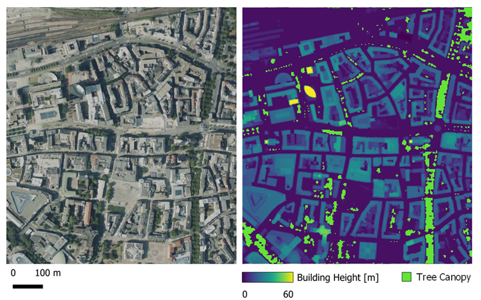

.. _output_format:

Output Format
=============

This section describes the technical characteristics of the output data.
D2R’s nowcasting service generates raster data that represent various weather variables and a thermal discomfort index.
The weather variables are the:
- Near Surface Air Temperature (°C)
- Relative Humidity (%)
- Mean Radiant Temperature (°C)
while the discomfort index is:
- Universal Thermal Climate Index (UTCI, °C), which is also given in a classified form.
Each variable and index are stored as a separate GeoTIFF file

.. _file_naming_convention:

Filenames
---------

The filenames of the results files adhere to the following template:

``DO_{varname}_{year}_{doy}_{hour}_v{version}{suffix}.{extension}``

This template includes the following keyholders:

- ``{varname}``: The variable name, e.g. MRT, UTCI, etc.
- ``{year}``: The year, e.g. 2024, 2025, etc.
- ``{doy}``: The day-of-year, e.g. 001, 002, ... 365
- ``{hour}``: The hour of the day in UTC time, e.g. 00, 01, 02, ... 23
- ``{version}``: The backend code version, e.g. v0.0.0, v1.1.2, etc.
- ``{suffix}``: An optional underscore-prefixed suffix for the file such as *_cog* for Cloud Optimized GeoTIFFs
- ``{extension}``: The file extension, e.g. tif

For example:

``DO_MRT_2025_152_12_v0.8.0_cog.tif`` is the Dortmund Mean Radiant Temperature GeoTIFF image generated for 
2025-06-01 (day-of-year 152) at 12:00 UTC with the code version 0.8.0 converted to a Cloud Optimized GeoTIFF.

.. _spatial_coverage:

Spatial Coverage
----------------

The resulting data cover the administrative boundary of the city of Dortmund, as shown below:

.. figure:: data/04_2_spat_cov.png
   :align: center
   :alt: The spatial coverage of the data produced by D2R’s nowcasting service.

   The spatial coverage of the data produced by D2R’s nowcasting service.

The bounding box coordinates in ETRS89 / UTM zone 32N are given in the table below.

.. list-table:: Bounding Box Coordinates of the input data in ETRS89 / UTM zone 32N
   :header-rows: 1

   * - Min X [m]
     - Min Y [m]
     - Max X [m]
     - Max Y [m]
   * - 380150.0
     - 5694550.0
     - 406850.0
     - 5718850.0

.. _spatial_resolution:

Spatial Resolution
------------------

D2R aims to map thermal comfort across the city at the street level. To achieve this, the resulting files have a very high
spatial resolution of 3 meters. The spatial resolution of gridded data refers to the dimension of the grid
cell size representing the area covered on the ground. As such, it determines the level of detail that can be represented by
the raster data: the finer the resolution of a raster, the smaller the cell size and, thus, the greater the detail. This
fine resolution level allows for a very detailed representation of the urban features, such as buildings and trees, that
govern the thermal comfort of humans at street level.

   Example of how the buildings and trees in Dortmund’s city center are represented as raster data with a 3-meter spatial resolution (left: Google, right: derived from `GeoPortal NRW <https://www.bezreg-koeln.nrw.de/geobasis-nrw/produkte-und-dienste/hoehenmodelle/digitale-gelaendemodelle/digitales-gelaendemodell>`__).

.. _temporal_resolution:

Temporal Resolution and Coverage
--------------------------------

The resulting data are generated in almost real-time in hourly steps both for daytime and nighttime. The data are generated
only for the warm period of the year, namely from April (~ Day of year: 106) to October (~ Day of year: 300).
